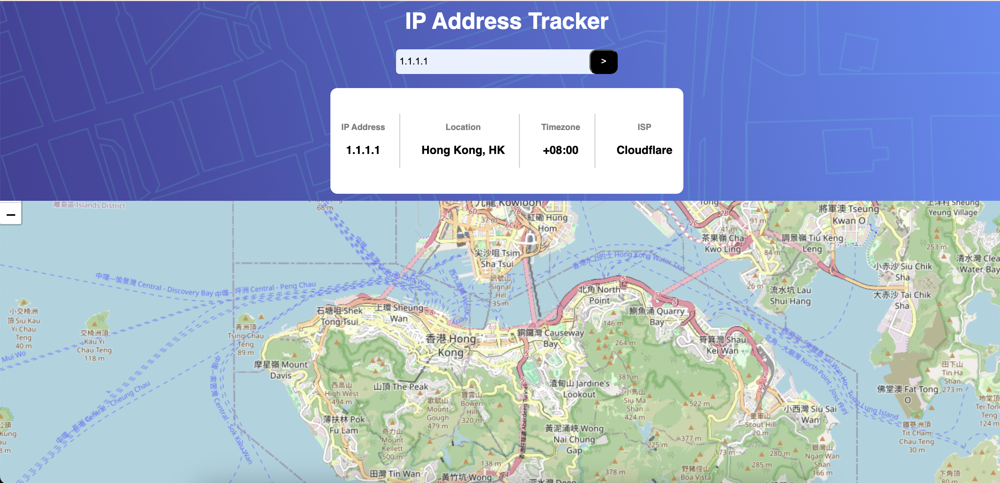

# IP Address Map Live Project
###### [Live Link](https://4drea4.github.io/IP-Address-Tracker/) 

## Andrea Etienne
*Monday November 24th, 2025, 9:00Am CST*

### Index:
-[Project Scope](#Scope) 
-[User Experience](#User-Experience) 
-[Project Setup](#Setup) 
-[Project Technology](#Technology) 
-[Project Notes](#Notes) 
-[Project Planning](#Plan) 
-[Post Project](#Post-Project-Review) 

#### Scope: 
The challenge is to build out this IP Address Tracker app and get it looking as close to the design as possible. To get the IP Address locations, I'll be using the [IP Geolocation API by IPify](https://geo.ipify.org/). To generate the map, I will be using [LeafletJS](https://leafletjs.com/).

### User Experience:
1. Users will be able to see their own IP Address on the map on the initial page load.
2. Search for any IP addresses or domains and see the key information and location.
3. View the optimal layout for each page depending on their device's screen size
4. See hover states for all interactive elements on the page

#### Setup:
1. Create your account for the [GEO API](https://geo.ipify.org/docs).
2. Setup according to the [LEAFLET Quickstartup](https://leafletjs.com/examples/quick-start/).
3. Clone or download the project.
4. Replace my api keys with your own in Index.js. 
5. Run your project locally
6. Test it out, enter ip addresses and test by entering various IP addresses.

#### Technology:
This project is utilizing:
1. Geolocation API
2. Leaflet Map API
3. HTML
4. CSS
5. Javascript

#### Notes:
#### Plan: 
    Pre-Plan: 
        From a high level overview this project will require:
        1. For a user to give an input
        2. Call on the Api
        3. Display the data from the API which will require object mapping
        4. There will be a need to show the location on a map
        
    Adjustments: I had to make some adjustments while trying to map coordinates it was something I could nto quite understand originally so I researched and read documentation on the API site as well as walked through some of their other uses to try to understand how to coordinate the map with the data from the other api. 

#### Post Project Review
I had the most trouble understanding how to implement the fetched data to the live map.  I was quite confused when it came time to understand just how to set the marker to the updated.  I appreciate typescript because when I realized what issues I was having, it was because of where I would have already known what to expect in some areas, I was attempting to call or pass the wrong thing.  I then struggled with adding a pin when locations are reloaded. I used this as an opportuntity to familiarize myself with error handling, object oriented programming, and async await.  I did find it a bit more challenging not using typescript, but I also enjoyed the challenges I ran into.  The use of two api's and learning how to get them to work with one another using Javascript object notation was particularly brain busting.  

#### Useful References:
1. [Fetch Best Practices](https://developer.mozilla.org/en-US/docs/Web/API/Fetch_API/Using_Fetch)
2. [Event Listener](https://developer.mozilla.org/en-US/docs/Web/API/EventTarget/addEventListener)
3. [API](https://stackoverflow.com/questions/66658771/api-endpoint-dependent-on-another-one)
4. [Centering](https://www.w3schools.com/css/css_align.asp)
5. [Borders](https://www.w3schools.com/css/css_border_sides.asp)
6. [Errors](https://developer.mozilla.org/en-US/docs/Web/API/HTMLSelectElement/checkValidity)
